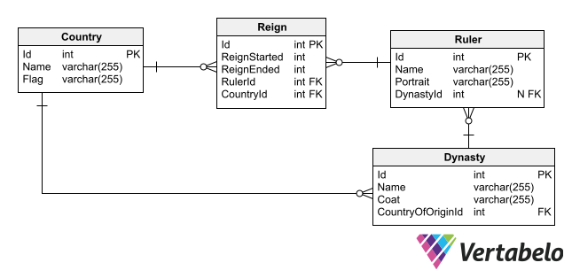

# Countries-RulersApp
Project founded to train a bit creating rest api with spring during summer.

## Live

Application was deployed to Heroku. Yu can find it by this link:
https://countries-and-rulers-app.herokuapp.com/

Probably more usefull will be link with swagger:
https://countries-and-rulers-app.herokuapp.com/swagger-ui.html

### Used Technologies
* Java 8/11
* POSTGRESQL Database
* Spring Framework

### About Project
This app will keep data about rulers of european countries from medieval period and allow to see this data by endpoints. Later on i created also frontend for this app to train a bit. Frontend was never finished due to getting a job in a different technology so i move my efforts to .NET

### Current entity diagram of database

